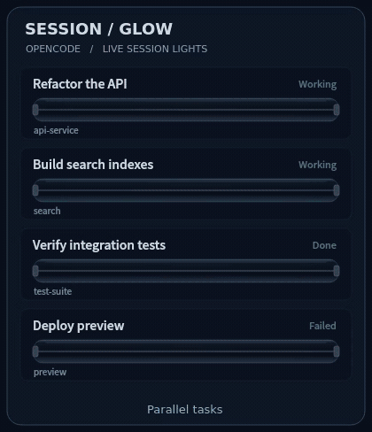

<div align="center">


# SessionGlow

<p><strong>简体中文</strong> · <a href="README.en.md">English</a></p>

**让每个 OpenCode 会话，都有一盏状态灯。**

一个放在桌面角落的悬浮面板。<br />
用交错电流、漂浮粒子和流动液体，呈现 Agent 的真实工作状态。

<p>
  
  
  
  
</p>

<p>
  <a href="#动效预览">动效预览</a> ·
  <a href="#快速开始">快速开始</a> ·
  <a href="docs/INSTALL.md">安装与接入</a> ·
  <a href="docs/USAGE.md">使用与排查</a>
</p>

</div>

---

## 动效预览

<p align="center">
  
</p>

<p align="center">
  <sub>实际程序渲染 · 合成演示会话 · 第五根灯管每 5 秒切换状态</sub><br />
  <a href="docs/assets/sessionglow-demo.webm">查看 24 fps 高清动效</a>
</p>

### 四种颜色，四种节奏

| 状态 | 灯管里的变化 | 你需要知道的事 |
| :--- | :--- | :--- |
| 🔵 **进行中** | 五股电流舒缓交错，细小粒子沿电流和空腔自由漂浮 | Agent 正在工作，或正在自动重试 |
| 🔴 **任务失败** | 电流逐渐收成直线，粒子停住，只留下轻微抖动 | 任务已终止，需要查看失败原因 |
| 🟢 **已完成** | 电流和粒子渐隐，绿色液体充满灯管并缓慢流动 | 这一轮任务已经结束 |
| 🟡 **待确认** | 保持饱满的电流波幅，叠加更明显、不规则的抖动 | 有授权请求或问题需要你回应 |

每次切换经过约 **0.8 秒的平滑过渡**。颜色、波幅、粒子运动和液体填充一起变化；连续收到新状态时，动画从当前画面继续。

## 放在角落，也能看清进展

| | |
| :--- | :--- |
| **一根灯管，一个主会话**<br />子 Agent 的活动归入主会话，等待确认也会一起提示。 | **最近任务，稳定排列**<br />默认显示 5 个，可配置为 1–12 个；工具调用和心跳不打乱顺序。 |
| **终端与 OpenChamber 都能接入**<br />汇总本机已加载插件的多个 OpenCode 服务和项目。 | **可拖动的悬浮面板**<br />支持置顶、位置记忆、隐藏到托盘，以及透明度、帧率和动效强度调节。 |
| **真实事件驱动**<br />直接响应任务、失败、权限和提问事件，不以 CPU 占用推测任务状态。 | **轻量的本地记录**<br />保留近期会话摘要；断线时标明连接中断，重新打开后自动恢复连接。 |

所有光效都限制在面板内部。授权和回答仍在 OpenCode / OpenChamber 中完成。

## 快速开始

当前主要适配 **Ubuntu 22.04.5 + GNOME 42.9 + X11**，已在 **OpenCode 1.18.31** 上验证。其他桌面环境、Wayland 置顶策略与混合 DPI 尚未验证。

### 1. 获取并安装

```bash
git clone https://github.com/YidaHao/SessionGlow.git
cd SessionGlow

sudo apt install python3-pyqt5
/usr/bin/python3 install.py
```

安装器为当前用户添加 OpenCode 插件和 Ubuntu 应用菜单入口，保留已有 `opencode.json`。启动器使用系统 Python，无需创建虚拟环境。

### 2. 打开面板

```bash
./run.sh
```

也可以在应用菜单搜索 **SessionGlow**。

想先看看全部动效？

```bash
./run.sh --demo
```

演示模式不依赖 OpenCode，会同时展示四种状态和连续切换效果。

### 3. 重启实际使用的 OpenCode

插件在 OpenCode 启动时加载。安装后，退出并重新打开你使用的终端或服务。

| 你的使用方式 | 接入方法 |
| :--- | :--- |
| 直接在终端使用 OpenCode | 在原项目目录执行 `opencode -c`，继续最近的会话 |
| 独立 `opencode serve` 服务 | 等待任务结束，按原端口和认证配置重新启动该服务 |
| OpenChamber 自动管理后台 | 等待任务结束，运行 `openchamber restart --port 3000`；替换为实际网页端口 |
| OpenChamber 连接外部 OpenCode | 重启对应的外部 OpenCode 服务；刷新网页不会重载服务插件 |

**OpenChamber 的后台不一定是 4096。** 它可能自动启动一个动态端口的服务。完整步骤见 [安装与接入指南](docs/INSTALL.md)。

连接后，在 OpenCode 发起一个任务，相应灯管就会亮起。

## 日常使用

- **拖动标题栏**移动面板，位置会自动保存。
- **隐藏面板**：点击右上角的 `−`，后台继续接收状态。
- **打开菜单**：点击右上角的 `···`，调整会话数量、置顶和外观。
- **托盘菜单 → 退出 SessionGlow**关闭程序，不中断 Agent 任务。

完成或失败的会话会留在列表中；旧会话被更新的任务挤出后，可增大显示数量。灰色表示尚无可靠结果；连接丢失会标明“连接中断 · 上次状态”，不会伪装成任务完成。

<details>
<summary><strong>配置文件与常用选项</strong></summary>

外观设置可在菜单中直接修改，也可编辑 `~/.config/sessionglow/config.json`：

```json
{
  "max_sessions": 5,
  "fps": 30,
  "opacity": 0.97,
  "intensity": 0.85,
  "always_on_top": true,
  "position": null,
  "port": 8790
}
```

手工编辑配置后重新打开面板。降低帧率可以减少绘制负载，降低动效强度可以减少画面干扰；隐藏时停止绘图。

```bash
# 使用指定配置
./run.sh --config /path/to/config.json

# 演示 15 秒后退出
./run.sh --demo --quit-after 15

# 导出合成预览图
./run.sh --render /tmp/sessionglow.png
```

</details>

<details>
<summary><strong>连上了吗？查看实际服务来源</strong></summary>

```bash
curl -s http://127.0.0.1:8790/health | /usr/bin/python3 -m json.tool
```

`sources` 显示实际 OpenCode 服务地址、PID 和项目目录，`sessions` 显示面板上的会话。一个服务可初始化多个项目，因此 `connections` 不等于服务数或会话数。

如果终端会话可见，而 OpenChamber 会话不可见，先核对后台端口和插件加载位置，再看 [连接问题排查](docs/USAGE.md#排查终端会话可见openchamber-会话不可见)。

</details>

## 本地接入，按需运行

插件通过本机 `127.0.0.1:8790` 发送会话标题、目录、状态和时间等元数据。**不会向面板传输提示词正文、回答正文、工具参数或服务密码。** 首次启动会通过 OpenCode API 回填有限的近期历史，用于恢复会话摘要；实时任务不等待历史加载。

会话摘要保存在 `~/.local/state/sessionglow/sessions.json`。面板关闭时不会阻塞 OpenCode，重新打开后通过心跳恢复；默认不设置开机自启。

## 文档与开发

| 文档 | 内容 |
| :--- | :--- |
| [安装与接入](docs/INSTALL.md) | 安装、升级、卸载、终端与服务接入、OpenChamber 两种模式 |
| [使用与排查](docs/USAGE.md) | 灯管状态、会话排序、外观设置、连接诊断 |
| [动效素材生成](docs/assets/README.md) | 首页 GIF 与高清演示的生成方式 |

运行自动测试：

```bash
/usr/bin/python3 -m unittest discover -s tests -p 'test_*.py' -v
node --test tests/plugin.test.mjs
```

安装插件并启动面板后，可验证真实 OpenCode 多会话行为：

```bash
/usr/bin/python3 tests/live_opencode.py
```

它通过临时会话和本地短命令检查主子会话归属、排序及状态变化，不请求模型。桌面交互测试和更多命令见 [使用文档](docs/USAGE.md) 与 [测试目录](tests/)。

---

<p align="center">
  <sub>一眼看见进展，然后继续手头的事。</sub>
</p>
